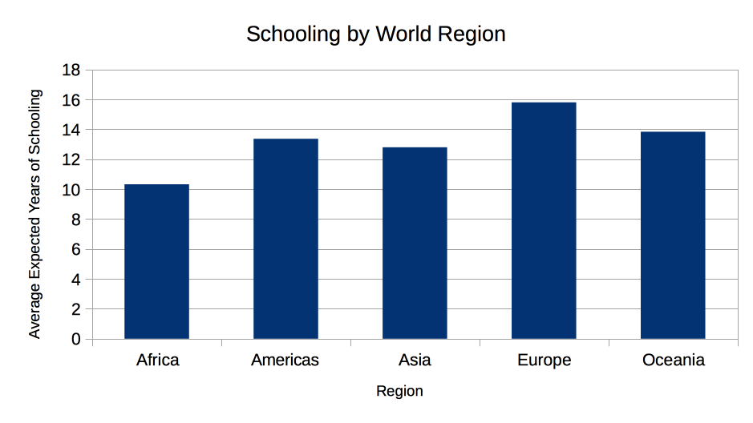
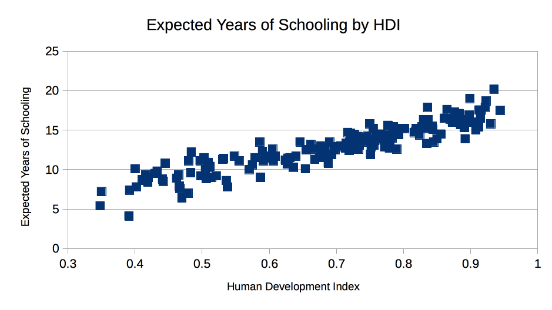

# Ben Bouvier's Studio 2 findings:

I decided to look at expected years of schooling. Here are some of my findings!

For all the countries _in the 2014hdi csv file_...

- mean expected years of schooling: 12.89
- median expected years of schooling: 13.1
- quartile 1: 11.1
- quartile 2: 13.1
- quartile 3: 15.0
- quartile 4: 20.2

