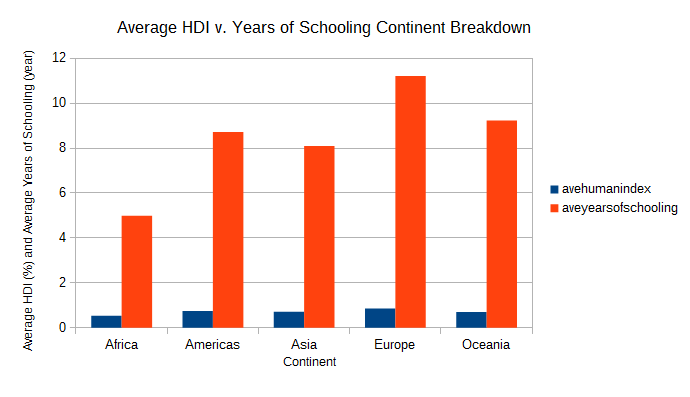
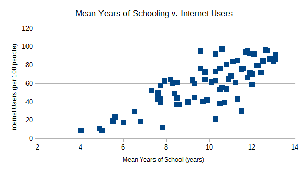

#Studio 2 - World Data
*Brandon Dale*

#Purpose: 
I aimed to explore how several variables related to the Human Development Index (HDI). 

###Representation 1:
.

Particularly, I explored how the average HDI of each continent compared to the average years of schooling seen in that continent. Utilizing a pivot table, bar graph, average function and a sort function, the graph reveals an interesting finding about how the continents compare to one another in these variables. The most notable finding is that in each continent, when HDIs are averaged among their respective countries, there is substantially less deviation in HDI than expected. 

###Representation 2: 

.

This representation explored the relationship between internet usage and average education received via a scatter plot. Within this representation, there is no accounting for each individual country, as I wanted to determine if, globally, the trend of higher internet usage corresponding to higher levels of education could be accepted. As expected, it can be seen that more internet users also have higher average time spent in schooling.

###Additional Task/Data:

Below are brief descriptions of how other functions were utilized that can be seen in the raw data set.

Color scale- used to find trends in life expectancy
Mean vs. median- calculated life expectancy
Quartiles- used to find quartiles in mean schooling
Filters- used to examine data based off of the continent 
Sorting- used to determine which education/HDI values were highest 
VLOOKUP- determined what region several countries were from
 

