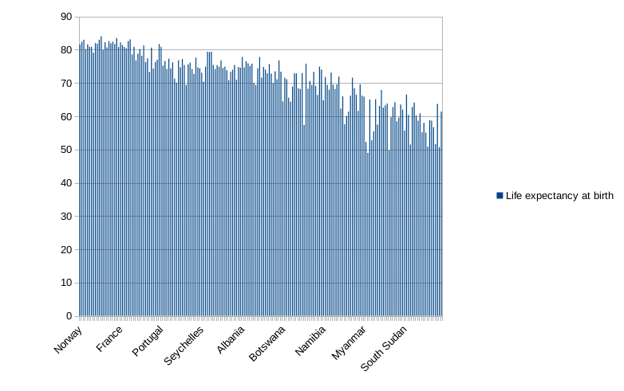
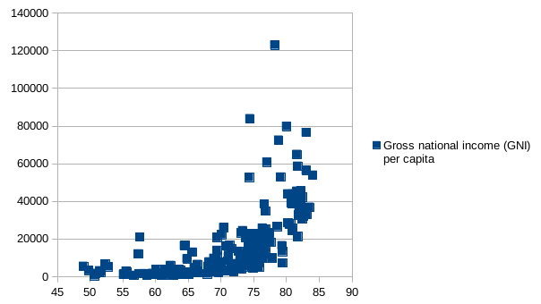

#Brian Franklin Studio 2 Assignment

#Median:
> Mean years of schooling

> 8.5 years

#Mean: 
> Internet users (per 100 people)

> 93.17 users

#Quartile: 
> Third quartile of Gross National Income

> $22800.5

#Filter:
> I selected column I "Region" and followed the path Data > Filter > Autofilter, then clicked the drop down arrow, then unchecked every region except for Europe to get a filtered data set only showing the values for countries in Europe.  

#Sorting:
> I went to Data > Sort and changed the category in the first drop down arrow to Life expectancy at birth.  Then I changed the ordering from ascending to descending, and clicked OK.  This gave me the same data file, arranged in vertical order from highest life expectancy at the top to lowest life expectancy at the bottom of the spreadsheet.  The rest of the values were likewise kept with their respective countries.  

#Pivot Table:
I selected the entire table, then clicked on Data > PivotTable.  
Next, I dragged "Country" into Row Fields, and "Gross National Income" & "Mean years of schooling" into Data Fields.  I then double clicked on both of these data field inputs and changed the calculation from sum to mean.  

Then I clicked OK.  

The average GNI was 17014.8085106383
and the average of the mean years of schooling was 8.110106383

#VLOOKUP:
> I went to column I in the combined data sheet and used VLOOKUP to bring out the HDI index of each country.  I used the following formula:

> =IFERROR(VLOOKUP($A2, $A$1:$C$188, COLUMN(B1), 0),"")

> This provided the HDI's and made any N/A cells blank to clean the data.  

y-values: D2 to D189

x-values: A2 to A189

#Bar Charts:
> I clicked on the bar chart icon and clicked on column chart, then I entered the following data ranges:

> $Sheet1.$A$1:$A$189,$Sheet1.$D$1:$D$189

> This provided a bar chart for the mean life expectancy at birth for all of the countries in the spreadsheet.  
> Generally, it seems like some European countries (such as Norway) have very high life expectancies, while on the lower end of the spectrum you find many African nations, including the South Sudan.  

 

#Scatter Plot:
I plotted gross national income vs. Life expectancy at birth.  It seems that once the gross national income rises above $30,000 you se drastic increases in life expectancy overall.  

My data ranges were: $Sheet1.$D$1:$D$189,$Sheet1.$G$1:$G$189

 

