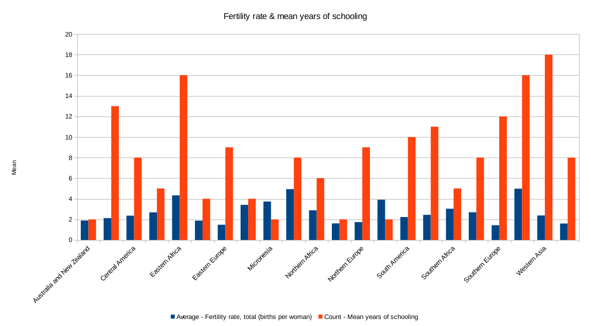

# Welcome!

This is an online [Markdown](http://en.wikipedia.org/wiki/Markdown)
editor. Whatever Markdown text you write here gets transformed into
HTML that gets displayed on the right.

I looked at the mean fertility rate versus mean years of schooling in the subregions provided in the dataset. My hypothesis was that with lower mean school years of schooling, we would find higher mean fertility rates. Interestingly, the data shows this is not necessarily the case - there is no definite correlation between the two variables. in New Zealand and Australia, for example, we had a 1:1 relationship. In Micronesia, low mean years of schooling correlate with high fertility rate, and in Eastern Africa, high mean years of schooling correlate with low fertility rates. Obviously, there are more factors at play here, but it's interesting to look at the relation between education & fertility rates in in developed versus non-developed regions of the world. 

I calculated the value of the 75%/Q3 Refugee populations by country,=QUARTILE(V2:V189, 3) = 10,455.75

