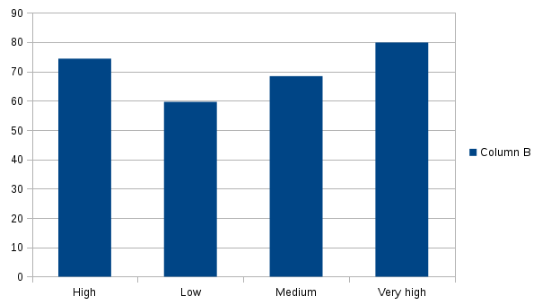
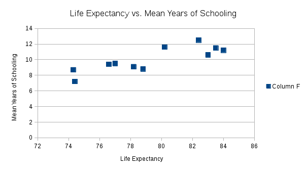

# A Comparison of Asian Countries

First, I filtered in our "all" countries sheet for Asian countries and ones with blank values. Of course, we say it's not all countries because we did a left join and only have countries from the 2014hdi data set and not all the ones from the continents sheet. Then, I performed some minor data cleaning by making sure the countries were listed the same in the different sheets so the vlookup command would function properly and return the necessary values for each data point.

After sorting through that data, I created a pivot table that depicted the level of Human Development Group vs. Average Life expectancy. For further data analysis, I also calculated the quartile values of each group (very high, high, medium, and low) of Human Development Group in order to see the ranges of life expectancy. In order to calculate this data, I first had to filter for each level of human development group. The graph below depicts these results

It is evident, and perhaps unsurprising, that the very high Human Development Group has the highest average life expectancy. Then, I decided to look at the life expectancy of these countries versus mean years of schooling. I filtered our original filtered Asian country sheet by very high human development group again. Then, I made a scatter plot, seen below, that depicts the aforementioned relationship.

Evidently, for the most part, it would appear that in this HDG, the higher the life expectancy, the higher the mean years of schooling, a relationship that I had hypothesized previously. 
