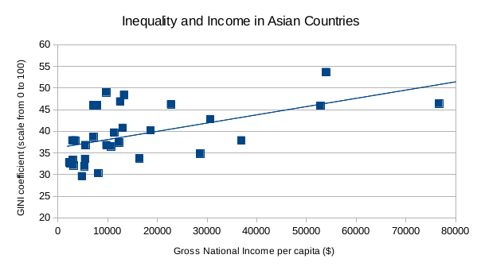

# Welcome!

This is an online [Markdown](http://en.wikipedia.org/wiki/Markdown)
editor. Whatever Markdown text you write here gets transformed into
HTML that gets displayed on the right.

## International Development

For my analysis, I examined the **Gross National Income per Capita** and the **GINI coefficient** of countries in Asia. 

measure | GNI/capita   | GINI coefficient 
------- | ------------ | ---------------- 
mean    | $21, 507     | 39.2            
Q0      | $1, 885      | 29.6             
Q1      | $4, 866      | 33.7           
Q2      | $10, 729     | 37.9             
Q3      | $28, 633     | 46.0             
Q4      | $123, 124    | 53.7     

First I _filtered_ out any data that was not for Asian countries. I then _sorted_ the data by region and subregion, and used the respective _formulas for the mean and five quartiles_ (minimum, first quartile, median, third quartile, and maximum) to evaluate the spread and centers of these two indicators within this range. 

While the _mean and median_ of the GINI coefficients were fairly close (39.2 and 37.9, respectively), the mean and median of the GNIs/capita were farther apart ($21, 507 and $10, 729, respectively). This would suggest that the right tail on the distribution of the GNIs/capita extends further than the right tail on the distribution of the GINI coefficients — in other words, **the GNIs/capita contain more high values dragging the mean above the median than the GINI coefficients do.**

Because GNI/capita is measured in dollars and the GINI coefficient is measured on a scale from 0 to 100, the ranges for these indicators are very different. The range of GNIs/capita is $121, 239, while the range of GINI coefficients is 24.1. 

In terms of GNI/capita, the country with the minimum value was Afghanistan, and the country with the maximum value was Qatar. In terms of GINI coefficients, the country with the minimum value was Pakistan, and the "country" with the maximum value was Hong Kong.

Using a _pivot table_ that displayed the average GNI/capita and average GINI coefficient for each subregion of Asia, I created two _bar charts_ to demonstrate the income and equality of Asia by subregion. I included the averages in Asia overall (total) for purposes of comparison.

I also created a _scatter plot_ to illustrate the relationship between the GNI/capita and GINI coefficients of Asian countries. 

From this graph, and its linear trend line with positive slope, I concluded that there is a positive correlation between these two variable: **Asian countries with higher incomes per capita tend to have a less equal income distribution.** However, as shown by the graph, the correlation is not extremely strong. 