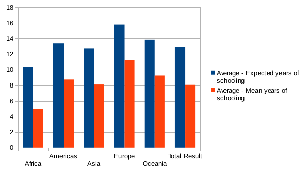
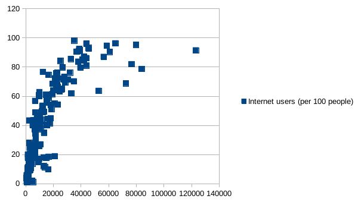

# Welcome!

This is an online [Markdown](http://en.wikipedia.org/wiki/Markdown)
editor. Whatever Markdown text you write here gets transformed into
HTML that gets displayed on the right.
We used a pivot table to compare the average years of schooling to the expected years of schooling in each region. The average years of schooling are much lower than the expected years of schooling across all regions, though the discrepancy between average and expected is greatest in Africa.

We used a scatter plot to look at the relationship between a country's Gross National Income by capita and the amount of internet users per 100 people in the country. We found a positive correlation between these two variables - as GNI increases, there is exponential growth in internet users per 100 people. 

We used a pivot table to compare mean life expectancy across regions. The highest life expectancy was in Europe (close to 80 years), while the lowest was in Africa (just above 60 years). 

