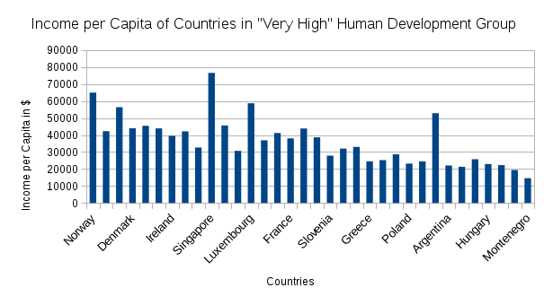
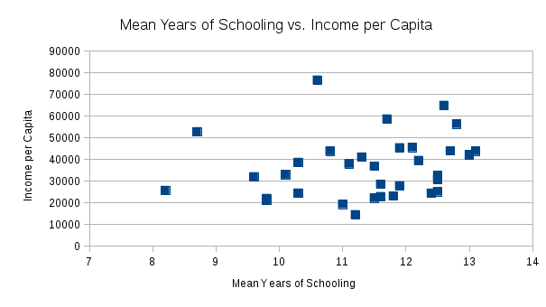
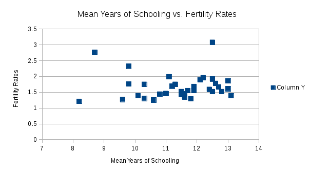

# CS100 Studio 2 Analysis

I decided to analyze most of the countries that had a "Very High" Human Development Group. I excluded the countries that had any blanks in their data, either because the country names between spreadsheets were different, or the country did not have data for some of the categories in 2014worlddev.

I first filtered the data so that only the countries in the "Very High" Human Development Group were shown. I then sorted the data by Human Development Index and created a bar chart that showed the income per capita of each country, sorted from highest Human Development Index to lowest. It seemed that countries with higher HDIs also had higher income per capita, besides a couple exceptions. Singapore, and Saudi Arabia had very high incomes per capita, but their HDIs were not as high and didn't seem to follow the apparent trend. I think Saudi Arabia's income per capita is so high because of its vast and lucrative oil industry that makes the country and its people a lot of money. Saudi Arabia does not have a high HDI because life expectancy is the third lowest and the mean years of education is the second lowest compared to the other countries in the "Very High" Human Development Group. 

In one of my scatter plots, I compared the mean years of schooling vs the income per capita of each country I was studying. I thought that populations with higher education levels would be earning more money. After studying the results, there seems to be no correlation between years of schooling and income per capita. The trend seems to be a straight line that shows no upward or downward trend. 

In my second scatter plot, I compared mean years of schooling with fertility rates. I thought countries with populations that were more educated would have fewer children. However, in my case where I was comparing between countries that were only in the "Very High" Human Development Group, there seemed to be no correlation between mean years of schooling and fertility rates. I am guessing that I would see a higher correlation if I compared all the countries with each other.

I also created a pivot table which compared the income per capita in different regions amongst all the countries in the "Very High" Human Development Group, even the ones I did filtered out earlier. This pivot table revealed that the net income per capita in Asia is the highest by far, $59,888. The incomes of the other regions were all similar to each other. I think this is because certain outlier countries in Asia have very high incomes, like Qatar, Singapore, Kuwait, and the UAE.