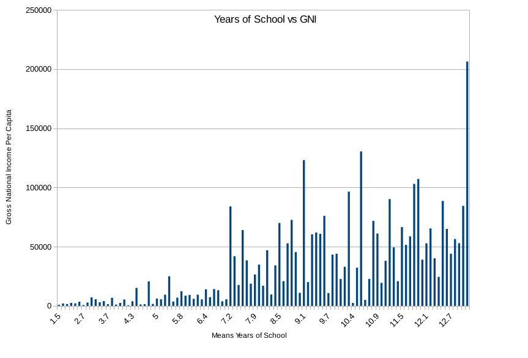
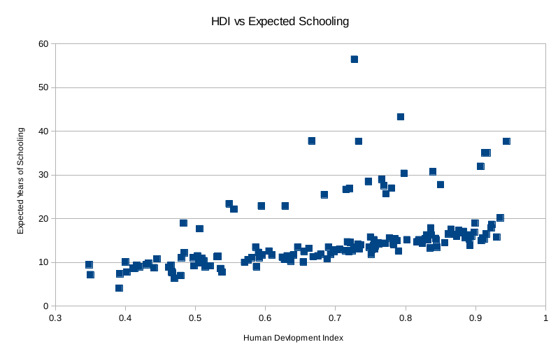

In libre office I used various tools to sort, filter, and visualize my data. To begin, I froze the top row so the data was easy to view. I next created a column on the left where I could put different functions. On the bottom of that column, I used formulas to find the mean, median, 1st quartile, 3rd quartile, and maximum for all of the different columns of data. I revewed the data and found interesting trends. I next created a bar chart comparing Mean Years of School and Gross National Income Per Capita. The bar chart showed an apparent positive correlation between the two variables. In general, the higher the mean years of schooling, the higher the GNI. This makes sense, as greater education typically leads to greater wealth. I also made a scatterplot comparing Human Development Index and Expected Years of Schooling. This chart also showed a positive correlation. As HDI increased, so did the expected years of schooling. This makes sense, as the more developed countries often have better school systems. 

