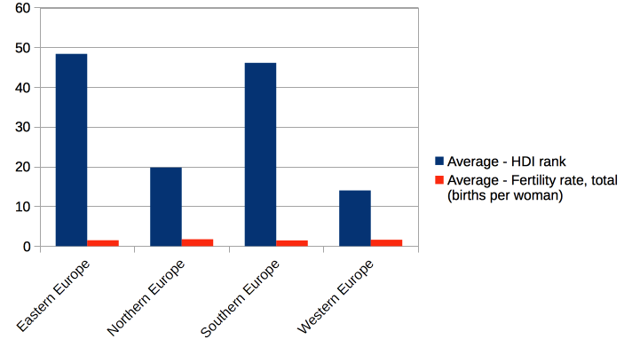
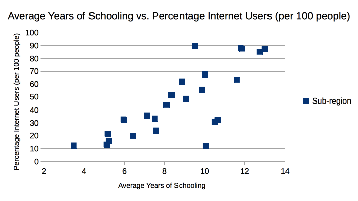

# 

Lisa Lee 
So first I analyzed the fertility rates of countries versus their human development index. I used a color scale to highlight the HDI score and compared it to a sorted fertility scale going in ascending order. As you can expect, the HDI score gradually worsened (became lower) as the fertility rates increased. However, most of the countries with worst fertility rates were not the ones with the best HDI index, even though the HDI scale gradually worsened with higher fertility rates. However, I saw many instances of outliers to this trend. 

Additionally, using a filter, I found that of the top 25 countries with the lowest fertility rates, 19 were in Europe. Of the top 50 countries, 42 were in Europe. However, within a chart representation, I showed that although the HDI index varied widely across Europe, its fertility rate still remained consistently low throughout, suggesting that the fertility rate could be low regardless of its HDI rate. This suggests different factors rather than income may be at the root for Europe's low fertility, such as cultural factors.

Another interesting comparison I did was between two variables, internet usage and mean number of years of education. Because there were too many different countries to sort through, I grouped them mainly by sub-region--taking a pivot table and finding the average number of years of education and the average internet usage. This I graphed on a scatter plot, showing a positive line. This indicates that as mean number of years of education rise, so does the typical internet usage for a region. 

Additionally, I was interested in the disparity between the mean number of years of education for a country and its expected number of years. I made an additional column and put as its equation the estimated number of years minus the mean number of years, then ordered it from min to max. What shocked me was that certain countries with good HDI had the greatest disparities between the mean number of years of education and expected--with the actual number always falling short of the expected number. Iceland (HDI: 16), Portugal(43), Argentina(40), and Spain (26) all had significant gaps in their education, from 7 years up to 9 years difference. On the other hand, countries with low HDI, like Uzbekistan, Turkmenistan, and the Republic of Moldova had poor HDI but high number of actual and expected years of education. Usually I would expect a significant gap or failure to accomplish the expected number of years of education to be indicative of a country with a disrupted society like Syria, or a country with serious economic or political issues--not a "highly-developed" society such as Iceland or Portugal.  