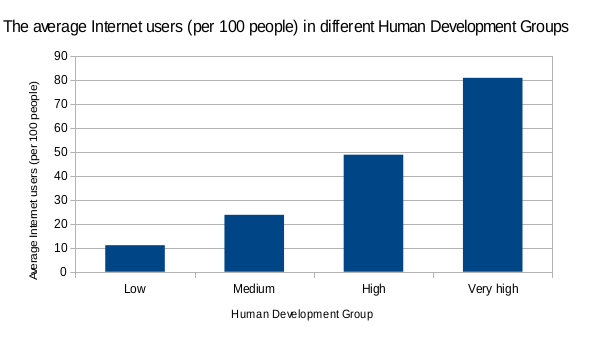
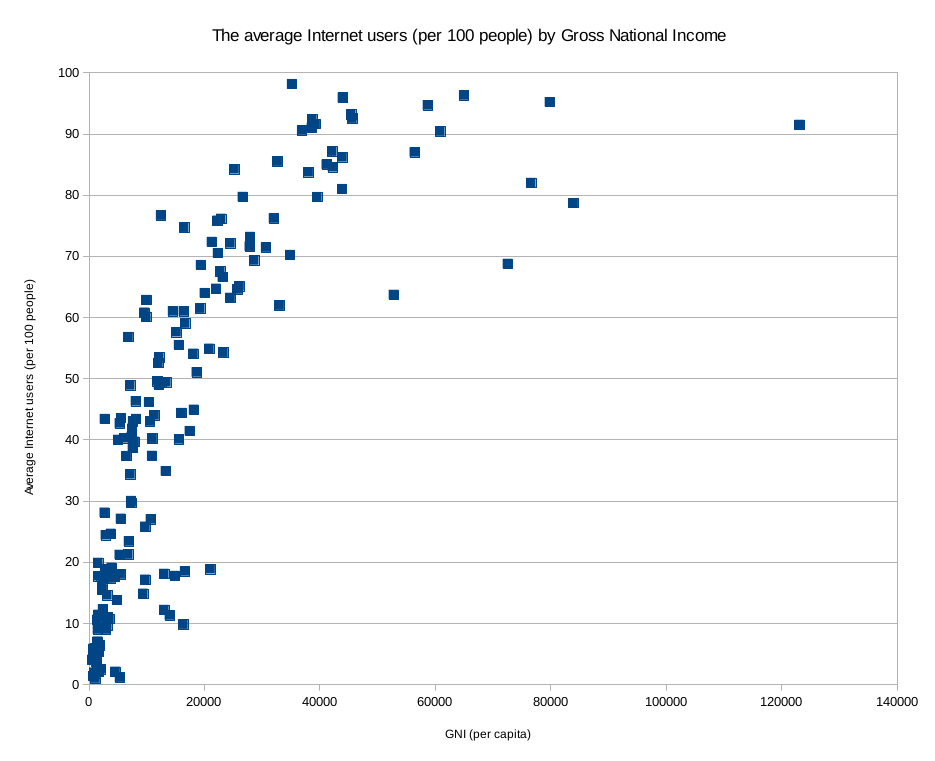

An Truong

Mai-Phuong Bach-Nguyen 

For Studio 2, we looked at 3 variables: **the average Internet users (per 100 people), Human Development Group, and GNI per capita.**

###HYPOTHESIS
Our hypothesis is more developed countries (countries that are categorized as High and Very High in HDG or countries with high GNI per capita) will have more Internet users. 

###CENTRAL TENDENCY 
In order to test our hypothesis, we calculated the **mean** and **median** of Internet users per 100 people, and **the 75th percentile**. 

* Mean: 43.74
* Median: 43 
* 75th percentile: 68.67

After that, we **sorted** the countries in ascending order according to the average Internet users (per 100 people) and also **filtered** out countries that fell below the median. We observed that, in congruence to our hypothesis,  more developed countries have more Internet users. Using the **VLOOKUP function**, we found that in Japan, out of 100 people, there are 90.58 Internet users. 

###DATA VISUALIZATION 

 
 

We created a **Bar chart** based on our **Pivot Table** with Human Development Group and the Average Internet users (per 100 people) of each group. Indeed, countries in the High and Very High groups also have significantly more Internet users compared to countries in the Low and Medium groups. In addition, we made a **Scatter Plot** with two quantitative variables: GIN per capita & the Average Internet users (per 100 people). Our findings were that indeed, countries with higher GIN per capita have more Internet users. 

###CONCLUSION 

In conclusion, our analysis supported our hypothesis that number of Internet users in a country correlates positively with that country's human development, operationally defined as their assortment into different Human Development Group and their Gross National Income per capita. 

