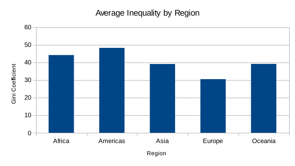

# Hi!

Marcus and Pearson have mapped average inequality in the world by region. We used a pivot table to calculate the average GINI coefficient by region. We concluded that the Americas have the highest level of inequality while Europe has the lowest. Below is a bar graph showing our results

Second we calculated a scatter plot to determine the relationship between the total population of a country and its corresponding rural population %. 
We concluded using a pivot table that there is no correlation between the two variables.

