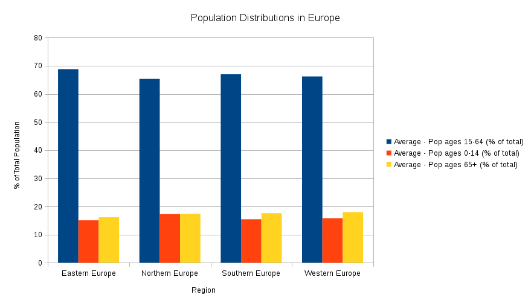
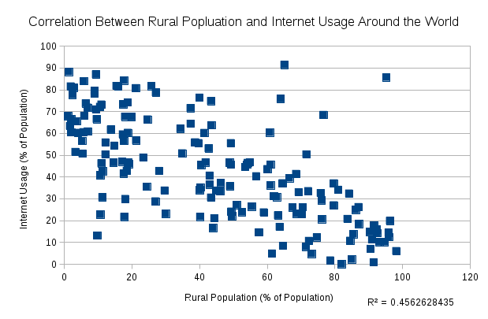

# Studio 2 Analysis

First, we decided to analyze the population distribution by sub-regions in Europe. To do this, we used filtering techniques to include only the countries in Europe. Second, we created a pivot table of population data by sub-regions of Europe. This allowed us to easily highlight the data we wanted in our chart. To visualize the population distributions, we created a bar chart with three sections per region to show the percentage of the populations that fell into three age categories: 0-14, 15-64, and 65+. We found that while western Europe had the highest population growth by percentage, northern Europe had the highest percentage of people ages 0-14. This seems paradoxical, as you would expect the sub-region with the highest percentage of young people to be the fastest growing overall, however, our measures did not include the raw populations of the four sub-regions. 

Next, we decided to examine the relationship between internet usage and the proportion of rural dwelling citizens by country. Our theory was that there would be an inverse relationship between the proportion of rural citizens and the percentage of internet users. This was confirmed by scatter plot, as you can see in the following chart: 

There is a clear negative linear relationship between the rural populations of countries and the proportion of internet users with an R-squared value of 0.46. This is intuitive as underdeveloped nations with low urbanization lack the logistical infrastructure to provide internet to the majority of its citizens. 

