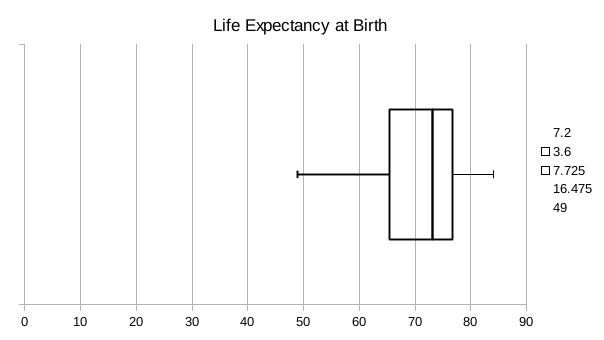
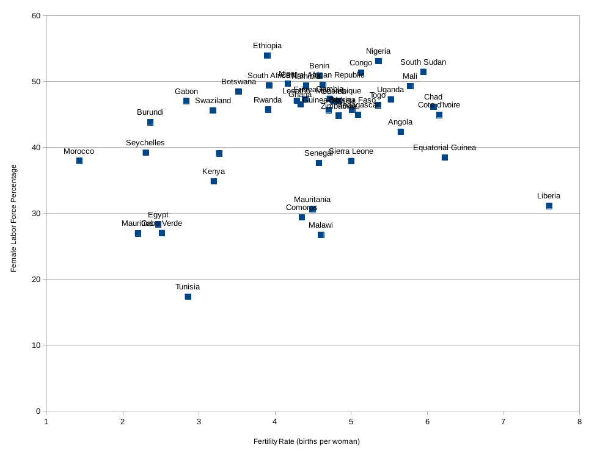
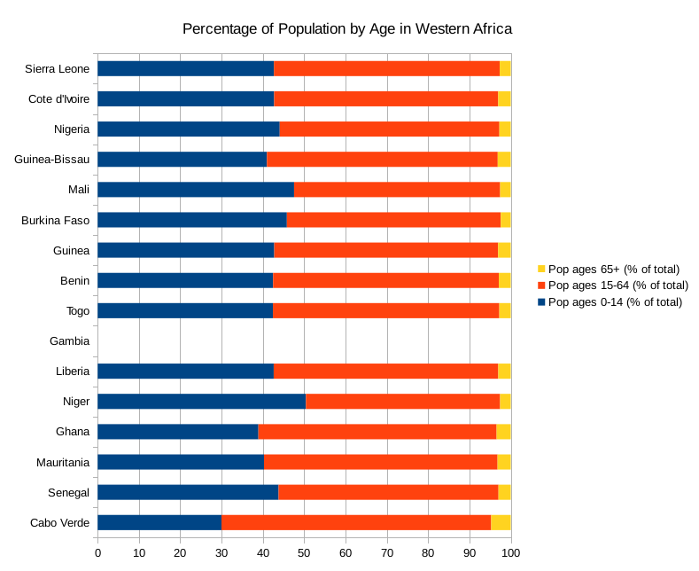

# Welcome!

Today, we are analyzing data on international development from across the world! Enjoy :) 

**Life Expectancy at Birth across Countries**

Using SORT, we sorted the data by life expectancy at birth in descending order and found that Hong Kong has the highest life expectancy at birth of the 189 countries. At the other end of the table is Swaziland with a life expectancy at birth of just 49 years. 

We also created a box-and-whisker plot, as seen below. 

In order to create the box and whisker plot, we had to use the Quartile function to figure out what the Q1 and Q3 marks were. We also had to use the Median function to figure out what the Q2 mark was. 

As seen from the above plot, we can see that the median life expectancy at birth is 73.2 years. The mean, however, is 71.1 years. This shows us that the data is left-skewed. 

Within the lowest 25% of life expectancies, there is a huge range, from 49 years to 65.5 years, suggesting that local factors probably contribute to this huge spread. 

**Relationship between Female Labor Force Participation and Fertility Rate in African Countries**

First, we filtered the entire data set by region and selected Africa for Region. Then we created the scatterplot using the two columns of Female Labor Force Participation and Fertility Rate.

There appears to be a general trend that as the fertility rate increases the percentage of female labor force participation increases as well; however, this relationship is not very strong. It's interesting to see that as the number of births per woman increases that the participation in labor force increases. 

**Western African Population by Age**

In order to make this bar chart, we first used the FILTER function to filter out data on Western Africa. Following which, we created the bar chart using the 3 columns with data on the percentage of the population for various ages. 

From this data, it is clear that most of the Western African countries have more than 40% of their population made up of youth between the ages of 0 and 14, except for Cabo Verde and Ghana. This has important policy implications as it means the governments will need to pour a significant amount of money into education and ensure there are enough jobs when this group graduates. 

This bar chart is organized by life expectancy, with Sierra Leone having the highest life expectancy and Cabo Verde on the other end. However, it is interesting to note that Cabo Verde actually has the biggest population for the range of 65 years and above! 

Thanks for reading :) 

