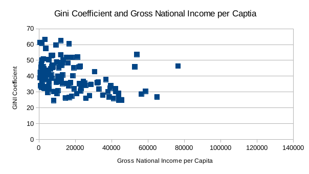
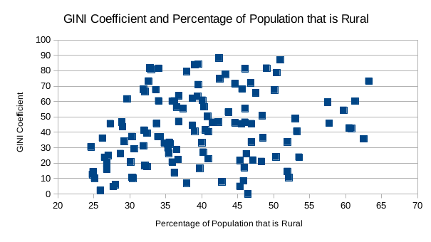

# Studio 2 Findings

During this studio, I sought to compare the GINI Coefficient to several other metrics and see the correlations between the Gini Coefficients and these metrics.  I compared the Gini Coefficient to the Human Development Index, Percent Population Growth, Gross National Income per Capita and Percent of Population that is Rural.  Based on the mean and median, I found that the Gini coefficient, Gross National Income per Capita and Percent of Population that is Rural were all right skewed and that the Human Development Index was left skewed.  

A scatter plot between the Gini coefficeint and human development index showed no correlation, as did the scatter plot between the GINI Coefficient and the percentage of population that was rural.

Moreover, the scatter plot for the Gini Coefficient and Gross national Income per Capita showed that the GINI Coefficient of a country generally decreases as the gross national income per capita increases.

As a result, one can conclude that the gross national income per capita is a better metric for estimating the GINI Coefficient than the human development index and percentage of population that is rural. 

Furthermore, the following graph shows the average GINI Coefficient of the countries in the Very high, high, middle and low human development groups.  

