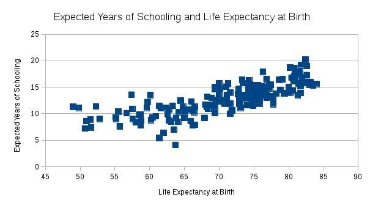

Marina Renton

# Studio 2

The **average life expectancy** among the countries is 71.11 years, while the **median life expectancy** is 73.2 years, indicating that the distribution of life expectancy at birth has a longer left tail. The **minimum population** is 21,097 (Palau); the **first quartile of population** (25th percentile) is 2,140,631; the **median population** is 8,295,840; the **third quartile of population** (75th percentile) is 23,899,618.5; the **maximum population** is 1,364,270,000 (China). 

Using the **VLOOKUP** function, I found that the unemployment rate in Sweden is 8 percent. 

I **sorted** the countries by unemployment rate and found that the lowest reported unemployment rate is in Qatar, at 0.3%. The highest reported unemployment rate is in Mauritania, at 31%.

I created a **pivot table** to compare region and average life expectancy at birth. The Europe region has the highest life expectancy at birth, at approximately 78.57 years. The Americas region has an average life expectancy at birth of 74.67 years; the Asia region has an average life expectancy at birth of 72.83 years; the Oceania region has an average life expectancy at birth of 72.15 years; the Africa region has an average life expectancy at birth of 61.30 years. 

Attached is a **column chart** of average life expectancy at birth by region: 

. 

The chart reflects the same information observed in the pivot table -- the Europe region has the highest average life expectancy at birth, while the Africa region has the lowest average life expectancy at birth.

Attached is a **scatter plot** of expected years of schooling and life expectancy at birth: 

. 

There appears to be a slight positive correlation between expected years of schooling and life expectancy at birth: The higher the life expectancy, the higher the expected years of schooling. 
