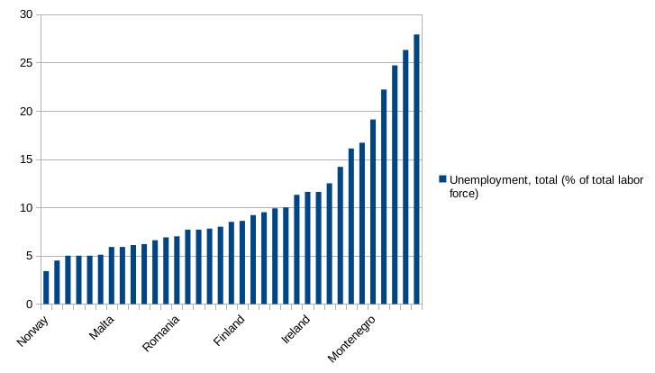
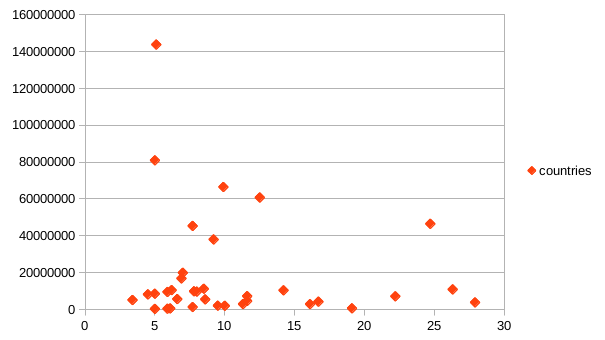

# Niki and Andrew's Findings!

For our analysis, we chose to look at global unemployment trends. We found the mean and median of unemployment worldwide were 8.51% and 6.90%, respectively. Since the mean was greater than the median, we concluded that global unemployment was right-skewed -- there are a few countries with much higher unemployment than most. We were able to get more evidence for this by analyzing the quartiles of the unemployment data. The first three quartiles were all under 11%, while the fourth was 31%.

We then decided to investigate which region had the highest unemployment rate. We did this by creating a pivot table where we could find the average unemployment rate per continent. 

According to that table, Europe is the region with the highest average unemployment rate at 10.67%. 

We then decided to create a bar chart of the unemployment rates of European countries to see if they exhibited the same global trend of having relatively few countries with very high unemployment.  Our chart, included below, confirms that this is the case. 

We also decided to compare unemployment and population size to see if high levels of unemployment in smaller European countries would make the continent's unemployment levels seem disproportionately high. As you can see in our graph below, the countries with the highest unemployment rates also have relatively small populations, so the average unemployment rate likely overstates the unemployment rate for the continent as a whole.

