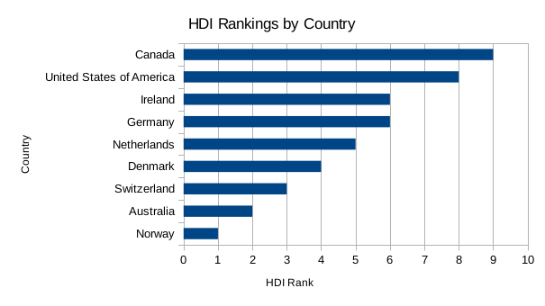
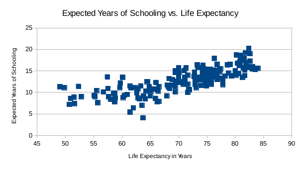

First, I sorted the data in ascending and descending order of the human development index. I wanted to compare the countries with the top hdi's with the countries with the lowest hdi's. I filtered out the other results.In addition, the countries with the top eight hdi's had unemployment rates in the median quartile. 

The unemployment rate for the countries with the top eight human development index is low. The median unemployment rate for these countries is typically lower than the average unemployment rate. 

By using a scatter plot, I determined that there is a relationship between life expectancy and expected years of schooling. In countries with the high life expectancy at birth, people tend to go to school longer. 

