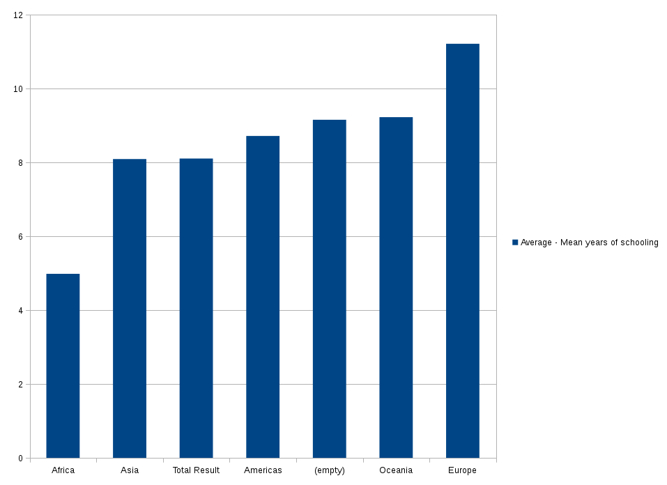
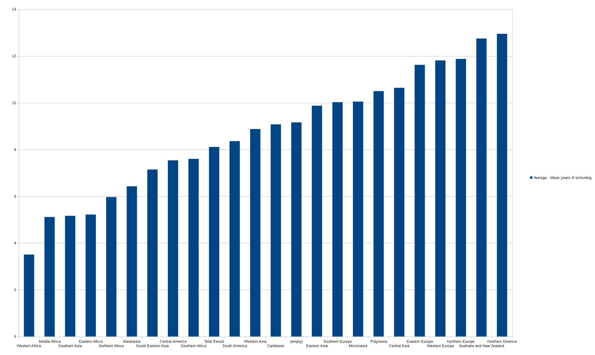

# World Data Analysis - Peter McHugh and Robert Petteruti

In our analysis we used different filters to determine that there was a relationship between the average number of years in school and the world region. We were able to conclude that when just continents were considered, Europeans seemed to spend more time on average in school than other continents, even the Americas. However, when we used our comparitive bar chart to compare schooling years and subregions we were able to see that Northern Americans actually spend the most time in school, with an average of 12.95 years. This shows how having very broad bins could skew our data and bias it toward a particular conclusion that in this case was not exactly accurate.

