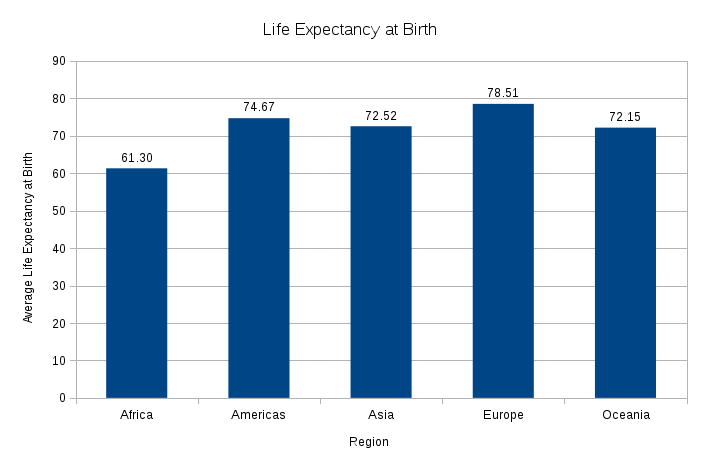
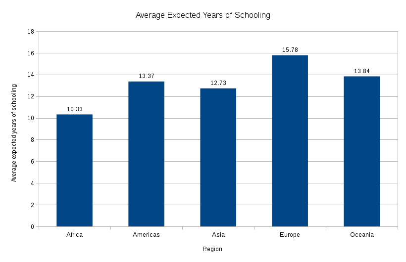

# CS100 Studio 2

For Studio 2, I am going to analyze life expectancy at birth and expected years of schooling of all countries provided in the data set. 

###Mean vs. Median

Using the formulas `AVERAGE` and `MEDIAN`, I found the average and median life expectancy and years of schooling across all of the countries. The average life expectancy is 71.1 years and the median life expectancy is 73.2 years. The average years of schooling is 13.1 years and the median years of schooling is 12.89 years. 

###Quartiles

I used the `QUARTILE` function to calculate the quartiles of life expectancy. The 0th quartile (or minimum) is 49 years, 1st quartile is 65.475 years, 2nd quartile is 73.2 years, 3rd quartile is 76.8 years, and 4th quartile (or maximum) is 84 years. 

###Filter

I filtered the data by sub-region to see life expectancy at a sub-regional level. 

###Sorting

I sorted the data by life expectancy.

###Pivot Table

I created a pivot table of average life expectancy and average expected years of schooling by region. 

###VLOOKUP

I was curious to know the life expectancy at birth of the United States. I used the `VLOOKUP` function to find the life expectancy at birth of the USA, which was 79.1 years.

###Bar Chart

I created a bar chart to see the frequency of life expectancy in ranges of 5 years.

I was curious in comparing the average life expectancy across different regions. I then chose to categorize the data by sub-region. There were 22 sub-regions, which creates a very crowded bar chart.

Instead, I decided to compare average life expectancy across regions. There are only 5 regions, so the bar chart is easier to comprehend. 

I was curious if the average expected years of schooling across regions was similar to the bar chart of average life expectancy. Here are the results.

###Scatter Plot

I created a scatter plot to observe the trend between life expectancy at birth and the expected years of schooling across all countries. In the scatter plot, it appears that a trend does in fact exist. 

