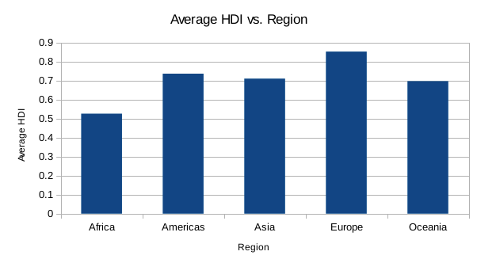

#### Data Fluency Studio 2, Josh Tartell & Yuta Inumaru

First, we examined the relationship between education and gross national income (GNI) per capita. We created a pivot table between mean years of schooling and average GNI per capita. Next, we generated a scatterplot (Average GNI per capita vs. Mean Years of Schooling) – our graph reveals an interesting trend: there is a positive correlation between mean years of schooling and average GNI per capita. In other words, more schooling corresponds with greater GNI per capita. Our analysis provides meaningful insights – if countries allocate more resources to education, they can achieve higher levels of national income.

 
Then, we sorted the data set by continent (in ascending order) and created a pivot table between region and average human development index (HDI). After, we generated a bar chart (Average HDI vs. Region). Our visual provides a high-level comparison between these regions. From our juxtaposition, we can definitively conclude that Europe and Africa present the highest and lowest HDI’s in the world, respectively. Furthermore, we see that Americas, Asia, and Oceania boast comparable HDI scores.

